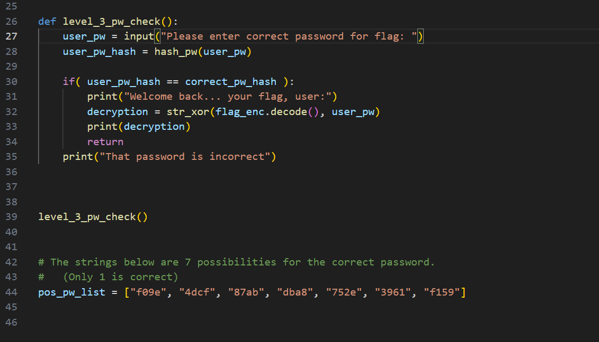
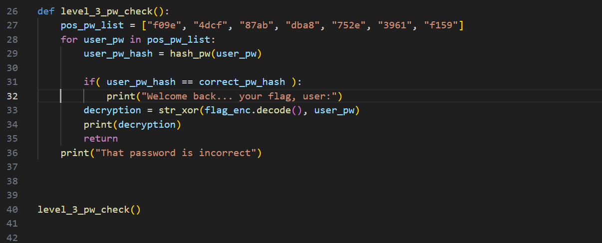
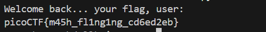

## Summary

Quick Password Cracking tutorial with easy methode.

### Hint
 - To view the level3.hash.bin file in the webshell, do: $ bvi level3.hash.bin
 - To exit bvi type :q and press enter.
 - The str_xor function does not need to be reverse engineered for this challenge.

### Solution
We begin by downloading the files. You can download manually or use the `wget` command in the terminal. Ensure the files need are in the same directory. Running the python file, we are prompted to enter the correct password.

Let’s check the code and understand its functionality.

The script tries each password from a list, turns it into an MD5 hash, and checks if it matches the known hashed password. If it does, the script uses an XOR decryption to reveal and print the flag.

The level3_pw_check() function prompts the user for a password, hashes it, and compares it against a stored hash. Since we have a list of seven possible passwords, we could test them manually, but that wouldn’t demonstrate much skill. Automating the process is more efficient and scalable, especially when dealing with multiple password combinations, ensuring we identify the correct password without manual guessing.

The modified the code will loop through the 7 passwords and check if they match the correct password. Let’s now run the modified code

